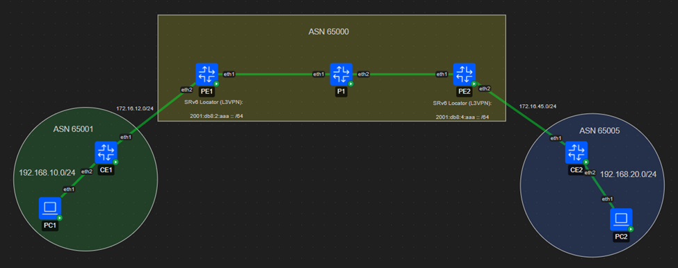
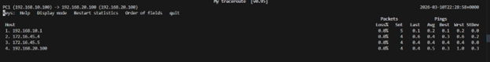
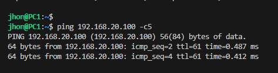
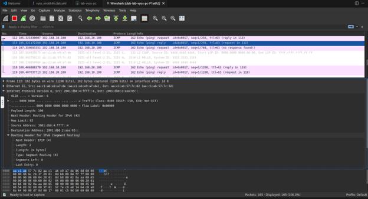
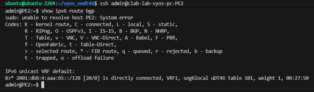
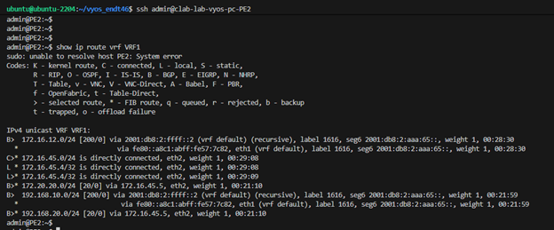
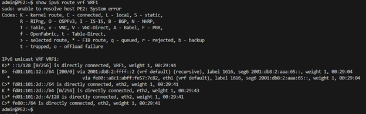
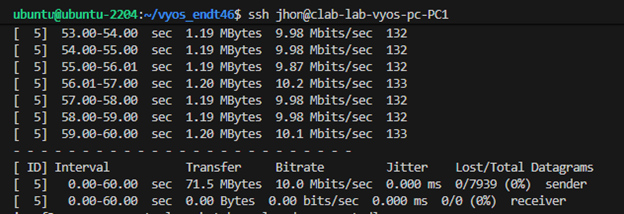

# 🌐 Implementación de L3VPN sobre SRv6 (Servicio End.DT46) con VyOS


*> Imagen 1 de tu Word: Aquí va la captura general de la Topología.*

## 📋 Descripción del Proyecto
Este repositorio contiene la configuración y validación de un laboratorio de enrutamiento avanzado desplegado con **Containerlab**. El objetivo principal es simular el núcleo de un Proveedor de Servicios de Internet (ISP) utilizando enrutamiento por segmentos sobre IPv6 (**SRv6**) para proveer servicios de VPN de Capa 3 (L3VPN) mediante el comportamiento **End.DT46**.

## 🛠️ Tecnologías y Protocolos Implementados
* **Orquestación:** Containerlab, Docker.
* **Nodos de Red:** VyOS 1.5 (Rolling Release), Linux genérico para CEs/Hosts.
* **Underlay Network:** IS-IS (Level-2) para enrutamiento interno IPv6.
* **Overlay Network:** MP-BGP (eBGP para CEs, iBGP en el core) con Address Family VPNv4/VPNv6.
* **Traffic Engineering:** Segment Routing IPv6 (SRv6) con locators L3VPN.
* **Aislamiento:** VRFs para segmentación de clientes (Tabla 101).

---

## 🔬 Validación y Pruebas (Troubleshooting)

### 1. Pruebas de Conectividad Extremo a Extremo
Se validó el enrutamiento a través del túnel SRv6 entre los extremos de los clientes (desde la red `192.168.10.0/24` hacia la `192.168.20.0/24`).

**Trazabilidad con MTR:**

*> Imagen 2 de tu Word: Aquí va la captura del "MTR de PC1 a PC5".*

**Prueba de latencia con Ping:**

*> Imagen 3 de tu Word: Aquí va la captura del "Ping de PC1 a PC2".*

### 2. Análisis del Plano de Datos (Wireshark)
Se realizó una captura de tráfico en el backbone (entre la interfaz eth2 de P1 y eth1 de PE2). La evidencia muestra la correcta encapsulación de los paquetes ICMP dentro de una cabecera SRv6, utilizando el Destination Address `2001:db8:2:aaa:65::`.


*> Imagen 4 de tu Word: Aquí va la captura de Wireshark con las cabeceras desglosadas.*

### 3. Verificación del Plano de Control (End.DT46)
El router PE asigna correctamente el SID con el comportamiento `uDT46` para desencapsular el tráfico y buscar el destino directamente en la tabla de enrutamiento de la VRF del cliente.

**Generación del SID en la VRF1 (Tabla 101):**

*> Imagen 5 de tu Word: Aquí va la captura de "Verify a SRv6 End.DT46 SID...".*

**Inyección de Rutas en el Kernel de Linux (IPv4):**

*> Imagen 6 de tu Word: Aquí va la captura de "Routing Tables IPv4".*

**Inyección de Rutas en el Kernel de Linux (IPv6):**

*> Imagen 7 de tu Word: Aquí va la captura de "Routing Tables IPv6".*

### 4. Pruebas de Rendimiento (Throughput con iPerf3)
Se inyectó tráfico UDP para validar la capacidad del túnel sin fragmentación ni desbordamiento de búfer. Se configuró un ancho de banda objetivo de 10 Mbps durante 60 segundos (`-u -b 10M -t 60`).


*> Imagen 8 de tu Word: Aquí va la última captura "iperf3 -c 192.168.20.100...".*
*Resultado: Transferencia exitosa con 0% de pérdida de datagramas y 0.000 ms de Jitter, confirmando la estabilidad de la encapsulación bajo carga.*

---

## 🚀 Cómo desplegar este laboratorio

1. Clonar el repositorio:
   ```bash
   git clone [https://github.com/Jhon1176/VYOS-SRV6-con-el-servicio-END.DT46.git](https://github.com/Jhon1176/VYOS-SRV6-con-el-servicio-END.DT46.git)
   cd VYOS-SRV6-con-el-servicio-END.DT46
